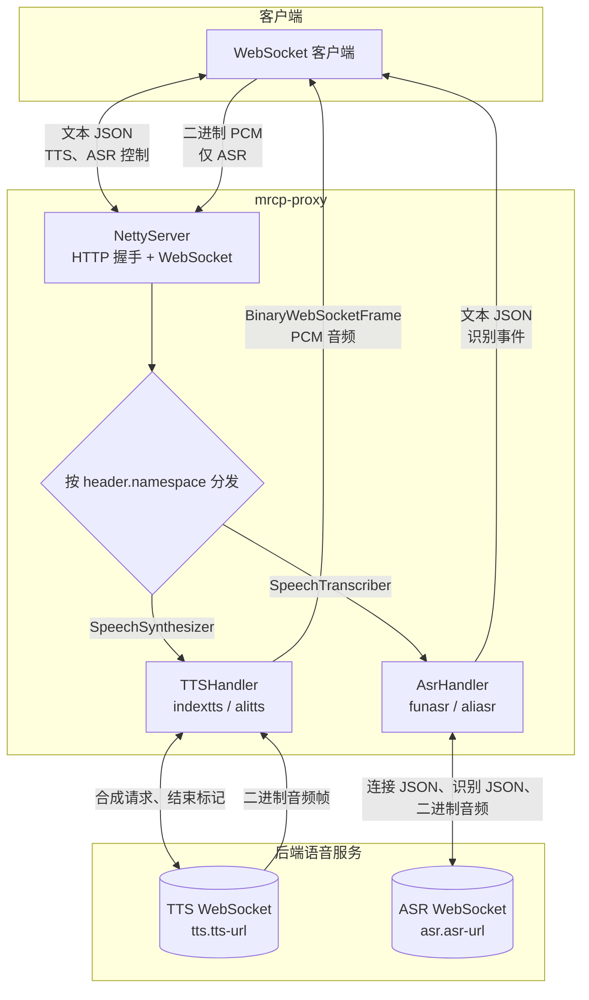

# mrcp-proxy

基于 **Spring Boot** 与 **Netty** 的语音代理服务：客户端通过 **WebSocket** 发送与阿里云 NLS 风格相近的 JSON 控制报文，由代理转发到后端的 **ASR（语音识别）** 与 **TTS（语音合成）** 引擎，并将结果回写给客户端。

## 功能概览

- **入站协议**：WebSocket（文本帧为 JSON，二进制帧为 PCM 音频，用于 ASR）。
- **TTS**：解析 `SpeechSynthesizer` 命名空间消息，将合成请求转到配置的 TTS 后端，并把音频/状态写回客户端通道。
- **ASR**：解析 `SpeechTranscriber` 命名空间消息；在 `StartTranscription` 时建立会话并与后端 ASR WebSocket 对接；后续二进制音频透传给后端，识别结果再封装回客户端。

## 架构



**数据流摘要**

- **TTS**：客户端发一条 `StartSynthesis` JSON → 代理连 TTS 后端 → 回 `SynthesisStarted` → 后端音频以**二进制帧**推给客户端 → 后端文本结束信号到达后回 `SynthesisCompleted`（当前实现会在完成后关闭连接）。
- **ASR**：客户端发 `StartTranscription` → 代理回 `TranscriptionStarted` 并连 ASR 后端；随后在同一条 WebSocket 上持续发 **PCM 二进制帧**；中间结果 `TranscriptionResultChanged`，句末 `SentenceEnd`；`StopTranscription` 结束会话。连接断开时代理会清理对应 `session_id` 的 handler。

## 技术栈

| 类别 | 说明 |
|------|------|
| 运行时 | Java 8 |
| 框架 | Spring Boot 2.3.5 |
| 网络 | Netty 4.1（HTTP 握手 + WebSocket） |
| JSON | Fastjson 2 |
| 工具 | Lombok、Hutool、Apache HttpClient、OkHttp |
| 云 SDK | 阿里云 NLS（`nls-sdk-tts`、`nls-sdk-transcriber`，供 `alitts` / `aliasr` 使用） |

`pom.xml` 中还包含 Springfox（Swagger 2），当前源码中未发现已启用的 REST 接口；业务入口以 WebSocket 为主。

## 项目结构（简要）

```
src/main/java/com/mrcp/proxy/
├── ProxyApplication.java          # Spring Boot 启动类
├── protocol/                      # 入站 JSON：MessageHeader、SynthesisMessage、TranscriptionMessage 等
├── ws/
│   ├── NettyServer.java           # WebSocket 服务、消息分发
│   ├── NettyConfig.java           # ws.port、ws.ws-path
│   ├── AsrConfig.java / TtsConfig.java
│   └── client/                    # 出站 WebSocket 客户端（含阿里云、Netty 实现）
├── handler/
│   ├── asr/                       # FunasrHandler、AliAsrHandler（工厂可注册扩展）
│   ├── tts/                       # IndexTTSHandler、AliTtsHandler
│   └── status/                    # ASR/TTS 状态机
└── utils/
```

## 配置说明

主要配置在 `src/main/resources/application.yml`：

| 配置项 | 含义 |
|--------|------|
| `server.port` | 嵌入式 Tomcat 端口；默认 `-1` 表示不启用 Web 端口，仅依赖 Netty WebSocket |
| `ws.port` | WebSocket 监听端口（默认 `8854`） |
| `ws.ws-path` | WebSocket 路径（默认 `/ws/v1`） |
| `tts.tts-handler` | TTS 实现：`indextts`（自建 WebSocket）、`alitts`（阿里云） |
| `tts.tts-url` | IndexTTS 等服务地址 |
| `tts.tts-properties` | 阿里云等所需的 appKey、AccessKey 等（勿将真实密钥提交到仓库） |
| `asr.asr-handler` | ASR 实现：`funasr`、`aliasr` |
| `asr.asr-url` | FunASR 等 WebSocket 地址 |
| `asr.asr-properties` | 阿里云 ASR 凭证等 |
| `*.audio-save-enabled` / `*.audio-save-dir` | 可选：保存调试音频到本地目录 |

请按部署环境修改 URL 与密钥；仓库中的示例值仅为占位。

## 构建与运行

```bash
# 编译打包
mvn -q -DskipTests package

# 运行（需本机已安装 JDK 8+、Maven）
mvn spring-boot:run
```

或可执行打包生成的 fat JAR（以实际 `target` 下文件名为准）：

```bash
java -Dfile.encoding=UTF-8 -jar target/mrcp-proxy-1.0.jar
```

## 客户端连接

在默认配置下，WebSocket 地址为：

```text
ws://<主机>:8854/ws/v1
```

- **TTS**：发送 JSON，`header.namespace` 为 `SpeechSynthesizer`（如 `StartSynthesis`），结构与 `SynthesisMessage` 一致。
- **ASR**：先发送 `SpeechTranscriber` / `StartTranscription` 等 JSON（`context.session_id` 用于会话）；随后在**同一连接**上发送 **PCM 二进制帧** 作为音频输入。

## 协议与 JSON 示例

以下字段名与源码中 `MessageHeader`、`MessageContext`、`SynthesisMessage`、`TranscriptionMessage` 及 `MrcpTTSMessage` 的产出一致；`message_id`、`task_id` 等请替换为实际值。

### 约定

| 类型 | 说明 |
|------|------|
| 文本帧 | 必须是合法 JSON；根对象含 `header`（必有 `namespace`、`name`），TTS/ASR 另有 `context`、`payload` |
| 二进制帧 | 在 ASR 会话建立后发送，内容为 **PCM**；与 `payload.format` / `sample_rate` 保持一致（常见为 8 kHz PCM） |

### TTS：客户端 → 代理（`StartSynthesis`）

```json
{
  "context": {
    "app": {
      "developer": "beiyu",
      "name": "sdm",
      "version": "c7b489cc81f069b51c92c4b1f6fe403c56030851"
    },
    "sdk": {
      "language": "C++",
      "name": "nls-sdk-linux",
      "version": "2.3.20"
    }
  },
  "header": {
    "appkey": "your-appkey",
    "message_id": "080434376305483c9e6a1c8bf67c41e9",
    "name": "StartSynthesis",
    "namespace": "SpeechSynthesizer",
    "task_id": "aa0796fdfbef486aa7d9b8cb5f46a305"
  },
  "payload": {
    "format": "pcm",
    "method": 0,
    "pitch_rate": 0,
    "sample_rate": 8000,
    "speech_rate": 0,
    "text": "欢迎使用。",
    "voice": "aixia",
    "volume": 50
  }
}
```

### TTS：代理 → 客户端

**合成开始**（`SynthesisStarted`）：

```json
{
  "header": {
    "namespace": "SpeechSynthesizer",
    "name": "SynthesisStarted",
    "task_id": "aa0796fdfbef486aa7d9b8cb5f46a305",
    "message_id": "<服务端生成>",
    "status": 20000000,
    "status_text": "GATEWAY|SUCCESS|Success."
  }
}
```

**音频**：服务端以 **WebSocket 二进制帧** 下发 PCM（无 JSON 包裹）。

**合成结束**（`SynthesisCompleted`）：

```json
{
  "header": {
    "namespace": "SpeechSynthesizer",
    "name": "SynthesisCompleted",
    "task_id": "aa0796fdfbef486aa7d9b8cb5f46a305",
    "message_id": "<服务端生成>",
    "status": 20000000,
    "status_text": "GATEWAY|SUCCESS|Success."
  }
}
```

**失败**（`TaskFailed`）：

```json
{
  "header": {
    "namespace": "SpeechSynthesizer",
    "name": "TaskFailed",
    "task_id": "aa0796fdfbef486aa7d9b8cb5f46a305",
    "message_id": "<服务端生成>",
    "status": 40000000,
    "status_text": "GATEWAY|ERROR|<原因>"
  }
}
```

### ASR：客户端 → 代理

**开始识别**（`StartTranscription`）；`context.session_id` 用于本会话，须与后续控制消息一致：

```json
{
  "context": {
    "app": {
      "developer": "beiyu",
      "name": "sdm",
      "version": "c7b489cc81f069b51c92c4b1f6fe403c56030851"
    },
    "sdk": {
      "language": "C++",
      "name": "nls-sdk-linux",
      "version": "2.3.20"
    },
    "session_id": "37ead8eace174a5a"
  },
  "header": {
    "appkey": "your-appkey",
    "message_id": "532a3961e6cc4a968867e41a290a0b91",
    "name": "StartTranscription",
    "namespace": "SpeechTranscriber",
    "task_id": "9dc290a7410449c882185544bfece96b"
  },
  "payload": {
    "enable_ignore_sentence_timeout": true,
    "enable_intermediate_result": true,
    "enable_inverse_text_normalization": true,
    "enable_punctuation_prediction": true,
    "enable_semantic_sentence_detection": false,
    "format": "pcm",
    "max_sentence_silence": 800,
    "sample_rate": 8000
  }
}
```

收到代理返回的 `TranscriptionStarted` 后，在**同一 WebSocket** 上持续发送 **二进制帧**（PCM 片段）；`StopTranscription` 或断开连接时结束。

**结束识别**（`StopTranscription`，`session_id` 与开始时相同）：

```json
{
  "context": {
    "session_id": "37ead8eace174a5a"
  },
  "header": {
    "appkey": "your-appkey",
    "message_id": "<新 message_id>",
    "name": "StopTranscription",
    "namespace": "SpeechTranscriber",
    "task_id": "9dc290a7410449c882185544bfece96b"
  }
}
```

### ASR：代理 → 客户端

**识别已启动**（`TranscriptionStarted`）：

```json
{
  "header": {
    "namespace": "SpeechTranscriber",
    "name": "TranscriptionStarted",
    "task_id": "9dc290a7410449c882185544bfece96b",
    "message_id": "<服务端生成>",
    "status": 20000000,
    "status_text": "GATEWAY|SUCCESS|Success."
  }
}
```

**中间结果**（`TranscriptionResultChanged`）：

```json
{
  "header": {
    "namespace": "SpeechTranscriber",
    "name": "TranscriptionResultChanged",
    "task_id": "9dc290a7410449c882185544bfece96b",
    "message_id": "<服务端生成>",
    "status": 20000000,
    "status_text": "GATEWAY|SUCCESS|Success."
  },
  "payload": {
    "index": 1,
    "result": "转",
    "confidence": 0.99
  }
}
```

**一句结束**（`SentenceEnd`，后端判定为最终结果时由代理转发）：

```json
{
  "header": {
    "namespace": "SpeechTranscriber",
    "name": "SentenceEnd",
    "task_id": "9dc290a7410449c882185544bfece96b",
    "message_id": "<服务端生成>",
    "status": 20000000,
    "status_text": "GATEWAY|SUCCESS|Success."
  },
  "payload": {
    "index": 1,
    "result": "转人工。",
    "confidence": 0.99,
    "status": 0,
    "gender": ""
  }
}
```

**失败**（`TaskFailed`）：

```json
{
  "header": {
    "namespace": "SpeechTranscriber",
    "name": "TaskFailed",
    "task_id": "9dc290a7410449c882185544bfece96b",
    "message_id": "<服务端生成>",
    "status": 40000000,
    "status_text": "GATEWAY|ERROR|<原因>"
  }
}
```

### Ping / Pong（可选）

服务端对 **Ping** / **Pong** 控制帧会回复**文本帧** `"ping"` / `"pong"`（见 `NettyServer`）；一般 WebSocket 库会自动处理协议级 Ping/Pong，接入时请注意勿与业务 JSON 混淆。

## 扩展后端

- **ASR**：在 `AsrHandlerFactory` 中 `register` 新的名称与 `AsrHandler` 构造方式，并在配置 `asr.asr-handler` 中指定该名称。
- **TTS**：在 `TtsHandlerFactory` 中同样注册，并配置 `tts.tts-handler`。

## 许可证与作者

项目内 `ProxyApplication` 标注作者为 wt；若需对外发布请自行补充 LICENSE 与贡献说明。
